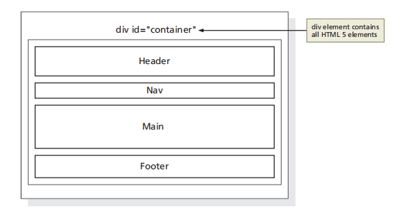

# TITO_Trainning_HTMLCSS

## Frontend training plan
## HTML CSS

<br></br>
## Table of contents

### [Chapter 1. Introduction to the Internet and Web Design]()

### [Chapter 2 : Building a Webpage Template with HTML 5]()

### [Chapter 3 : Enhancing a Website with Images and Links]()

<br></br>

__23/05/2023__

### Chapter 1. Introduction to the Internet and Web Design

<details>
<summary>Objectives</summary>

- Define the Internet and associated key terms
- Recognize Internet protocols
- Discuss web browsers and identify their main features
- Describe the types and purposes of websites
- Plan a website for a target audience
- Define a wireframe and a site map
- Explain how websites use graphics,navigation tools, typography, and color
- Design for accessibility
- Design for multiplatform display
- Define Hypertext Markup Language (HTML) and HTML elements
- Recognize HTML versions and web programming languages
- Identify web authoring tools
- Download and use a web authoring tool
- Create and view a basic HTML webpage

</details>


<details>

<summary>Project — Create a Basic Webpage</summary>

<details>
<summary>Roadmap</summary>

1. __RUN__ a __text editor__ and __create__ a __blank document__.
2. __Enter html tags__ in the document.
3. __Add text__ to the webpage.
4. __Save__ the __webpage__ as an HTML document.
5. __View__ the __webpage__ in a browser.

</details>
</details>


__24/05/2023__


<details>

<summary>Planning a Website</summary>


<details>
<summary>Purpose of the Website</summary>

- Each purpose demands a different type of website and design. 

- Example : 

> 1.The purpose of a website is to serve as an online store, the website should allow easy access to product information, reviews, and e-commerce tools.

> 2.The purpose of the website is to build a company’s reputation, the website should feature articles about the company, its employees, and its products and integrate with social media sites such as Facebook.

</details>


<details>
<summary>Target Audience</summary>

- You should understand the people who will use the website

- Knowing the makeup of your target audience — including age, gender general demographic background, and level of computer literacy — helps you design a website appropriate for them.


</details>


<details>
<summary>Multiplatform Display</summary>

__How do I consistently reach the people in my target audience when they are using so many difference devices?__

>  The solution is to use responsive design, which allows you to create one website that provides an optimal viewing experience across a range of devices. The website itself responds and adapts to the size of screen on the visitor’s device. 

</details>


<details>
<summary>Wireframe</summary>


__What tools can I use to create a wireframe?__

>You can use one of several free tools to create a wireframe, including Pencil Project, Mockplus, and Wireframe CC. You can also use drawing tools in Microsoft Word or PowerPoint or a pen and paper.
</details>


<details>
<summary>Site Map</summary>

- Shows the structure of a website

</details>


<details>
<summary>Graphics</summary>


- Add visual appeal to a webpage and enhance the visitor’s perception of your products and services.


</details>


<details>
<summary>Navigation</summary>

- The navigation of your website should be clear and concise.
- The navigation area should be prominent and easy to use. 
- Incorporating a search box near the navigation area provides another avenue for customers to find the item they want.


</details>


<details>
<summary>Typography</summary>

- The use of effective typography, or fonts and font styles, enhances the visual appeal of a website. 
- Above all, the text must be legible or the website is useless. 
- Typography also should promote the purpose and goal of the website.


</details>


<details>
<summary>Color</summary>

- Select a limited number of coordinated colors that help promote your purpose and brand.
- The combination of colors, also called a color scheme, contributes to the appeal and legibility of the website.
- Font and background colors must provide high color contrast for readability, so use dark text on a light background or light text on a dark background. 


</details>


<details>
<summary>Accessibility</summary>

- The mission of the W3C is “to lead the World Wide Web to its full potential by developing protocols and guidelines that ensure the long-term growth of the Web.” Information about the membership process is available at www.w3.org /consortium/membership.

</details>


<details>
<summary>Accessibility Standards for Webpage Developers</summary>

- According to the W3C, the goal of the web is to be accessible to all people, including those with a disability that limits their ability to perform computer tasks. 
- Anyone who wants to use the web must have content that incorporates the principles as follows:

+ __Perceivable:__ Information and user interface components must be presentable to users in ways they can perceive. Users must be able to perceive the information being presented. (It cannot be invisible to any of their senses.)Operable: User interface components and navigation must be operable. Users must be able to operate the interface. (The interface cannot require interaction that a user cannot perform.)


+ __Understandable:__ Information and the operation of the user interface must be understandable. Users must be able to understand the information as well as the operation of the user interface. (The content or operation cannot be beyond their understanding.)

+ __Robust:__ Content must be robust enough that it can be interpreted reliably by a wide variety of user agents, including assistivetechnologies. Users must be able to access the content as technologies advance. (As technologies and user agents evolve, the content should remain accessible.)


</details>


<details>
<summary>Planning Checklist</summary>


</details>


</details>


<details>
<summary>Understanding the Basics of HTML</summary>


<details>
<summary>HTML Elements and Attributes</summary>


- What does the hr in <hr> mean?

> Prior to HTML 5, the hr meant horizontal rule or reference. It is now called a thematic break and is used to distinguish between various topics on a single webpage.


</details>


<details>
<summary>Technologies Related to HTML</summary>

- XML — The W3C introduced XML (Extensible Markup Language) in 1998 to exchange and transport data. It does not replace HTML, but rather, can work with HTML by transporting web data obtained through an HTML webpage.
- XHTML — XHTML (Extensible Hypertext Markup Language) is a rewritten version of HTML using XML and was developed in 2000. Its syntax rules are more strict than HTML. It was created to work with XML-based user agents.


</details>


</details>

<details>
<summary>Understanding the Role of Other Web Programming Languages</summary>

<details>
<summary>JavaScript</summary>

- _JavaScript_ is a popular scripting language used to create interactivity within a web browser. Common uses for JavaScript include creating popup windows and alert messages, displaying the current date, and validating form data. JavaScript is a client-side scripting language, which means that the browser processes it on the client computer. JavaScript fles are typically named script with an .js fle extension. 
> JavaScript fles are referenced within an HTML fle through the use of a script element, as in <script src="script.js"></script>.  Reference to this fle is typically placed above the closing body tag. 

</details>

<details>
<summary>jQuery</summary>

- _jQuery_ is a library of JavaScript programs designed for easy integration onto a webpage. jQuery makes it easy for web developers to add JavaScript to a webpage. The JS Foundation, formerly known as the jQuery Foundation, (https://js.foundation) is a community of web developers that work together to create JavaScript ecosystem projects. Their mission is to “drive broad adoption and ongoing development of key JavaScript solutions and related technologies.” 

</details>

<details>
<summary>PHP</summary>

- PHP (Hypertext Preprocessor) is an open-source scripting language often used for common tasks such as writing to or querying a database located on a central server. PHP is a  server-side scripting language, which means that the PHP script is processed at the server. The result of the PHP script is often an HTML webpage that is sent back to the client. Pages that contain PHP scripts must have fle names that end with the fle extension .php.

</details>

<details>
<summary>ASP</summary>

- ASP (Active Server Pages) is a server-side scripting technology from Microsoft used to accomplish many of the same server-side processing tasks as PHP. Pages that contain ASP scripts must have fle names that end with the fle extension .asp.

</details>

</details>


__25/05/2023__


<details>
<summary>Using Web Authoring Tools</summary>


- Online Code Editors :

+ _Plunker_
+ _CodePen_

</details>

<details>
<summary>Creating a Basic Webpage</summary>


- __Do I have to indent certain lines of HTML code?__
_Indenting lines of code is not required, but it helps improve the readability of the webpage. In Figure 1–31, Lines 4 and 5 are indented to clearly show the elements contained in the <head> and </head> tags. If the code included elements between the <body> and </body> tags, those lines could also be indented to make them easier to read. Using indents is a good web design practice._


</details>

<br></br>

__26/05/2023__

### Chapter 2 : Building a Webpage Template with HTML 5

<details>
<summary>Project — Plan and Build a Website</summary>

<details>
<summary>Roadmap</summary>

1. Create website folders to organize files.
2. Create a template.
3. Enter html 5 semantic elements in the document.
4. Add comments and content to the document.
5. Validate the document.
6. Create and view the home page


</details>


</details>


<details>
<summary>Designing a Website</summary>

- Forward Fitness Club Website Plan:
1. _Purpose of the Website_ : To promote fitness services and gain new clients. The Forward Fitness Club mission: to facilitate a healthy lifestyle and help our clients meet their fitness and nutrition goals.

2. _Target Audience_ : Forward Fitness Club customers are adults between the ages of 18 and 50 within the local community.

3. _Multiplatform Display_ : Forward Fitness Club recognizes the growth in smartphone and tablet usage and wants a single website that provides an optimal viewing experience regardless of whether visitors are using a desktop laptop, tablet, or smartphone.

4. _Wireframe and Site Map_ : The initial website will consist of five webpages arranged in a hierarchal structure with links to the home page on every page. Each webpage will include a header area, navigation area, main content area, and footer area.

5. _Graphics_ : Forward Fitness Club wants to display its fitness equipment and logo to help with local branding. Photos of the facility, members, and staff will increase visual appeal.

6. _Color_ : Forward Fitness Club wants to use black and white as the primary colors for a clean, sophisticated look.

7. _Typography_ : To make the content easy to read, the website will use a serif font style for paragraphs, 
lists, and other body content, while providing contrast by using a sans serif font style for 
navigation links and headings.

8. _Accessibility_ : Standard accessibility attributes, such as alternative text for graphics, will be used to address accessibility


<details>
<summary>Site Map</summary>

- _Home page_: Introduces the fitness center and its mission statement

- _About Us page_: Showcases the facility’s equipment and services
- _Classes page_: Includes a schedule of available group training and fitness classes
- _Nutrition page_: Provides nutrition tips and simple meal plans
- _Contact Us page_: Provides a phone number, email address, physical address, and form for potential clients to request additional information about the fitness center’s services


</details>

<details>
<summary>Wireframe</summary>


__- What is the difference between a site map and a wireframe?__
>A site map lists all the webpages in a website that a user can access. It clearly identifies the number of pages in the website and shows how each page is linked to other pages. You can create a site map as an outline in a word processing document or as an image using flowcharting or graphics software. 
>In contrast, a wireframe shows the visual layout of the webpage to indicate where elements should appear such as the logo, search box, navigation bar, main content, and footer. You typically use graphics software to create a wireframe.

</details>

<details>
<summary>File Management</summary>

fitness -> main website folder     
├───css     |
├───images  |  -> website subfolders
├───media   |
└───scripts |

</details>

</details>

<details>
<summary>Using HTML 5 Semantic Elements</summary>

-  Indicates the header information on the webpage. Header content typically consists of a business name or logo and is commonly positioned immediately after the opening <body> tag.

```
<header>…</header>
```

<details>
<summary>Header Element</summary>

The header element structurally defines the header area of a webpage. 
The header element starts with a <header> tag and ends with a </header> 
tag. Content placed between these tags appears on the webpage as part of the 
header element. Web designers often place a business name or logo within 
the header element.

</details>

- Indicates the start and end of a navigation area within the webpage. The nav element contains hyperlinks to other 
webpages within a website and is commonly positioned immediately after the closing </header> tag.

```
<nav>…</nav>
```

<details>
<summary>Nav Element</summary>

The nav element structurally defines the navigation area of a webpage. The 
nav element starts with a <nav> tag and ends with a </nav> tag. The nav element 
usually includes links to other pages within the website.

</details>

-  Indicates the start and end of the main content area of a webpage. Contains the primary content of the webpage. Only one main element can appear on a page.

```
<main>…</main>
```

<details>
<summary>Main Element</summary>

The main element structurally defines the main content area of a webpage. 
The main element starts with a <main> tag and ends with a </main> tag. Each page 
can have only one main element because its content should be unique to each page. 
At the time this book was written, all current major browsers supported the main 
element, with the exception of Internet Explorer 11 and earlier versions. While 
Internet Explorer 11 will display content within the main element, it does not fully 
support the element. For example, Internet Explorer 11 might not correctly display 
formatting applied to the main element.

</details>

-  Indicates the start and end of the footer area of a webpage. Contains the footer content of the webpage.

```
<footer>…</footer>
```

<details>
<summary>Footer Element</summary>

The footer element structurally defines the bottom, or footer area, of a 
webpage. The footer element starts with a <footer> tag and ends with a </footer> tag. 
Common content found within a webpage footer includes copyright information, 
contact information, social media links, and policy links.

</details>

-  Indicates the start and end of a section area of a webpage. Contains a specific grouping of content on the webpage.

```
<section>…</section>
```

-  Indicates the start and end of an article area of a webpage. Contains content such as forum or blog posts.

```
<article>…</article>
```

-  Indicates the start and end of an aside area of a webpage. Contains information about nearby content and is typically 
displayed as a sidebar.

```
<aside>…</aside>
```

</details>

__29/05/2023__

<details>
<summary>Creating a Webpage Template</summary>

1. To Create a Webpage Template Document
2. To Add HTML 5 Semantic Elements to a Webpage Template
3. To Add a Title to a Webpage Template


<details>
<summary>Comments</summary>

```
<!-- Place your comment here -->
```

```
<!-- Student Name
 File Name
 Date
-->
```

- To Add Comments to a Webpage Template

> __Break Point__: If you want to take a break, this is a good place to do so. You can exit the text editor now. To resume at a later time, run your text editor, open the file called template.html, and continue following the steps from this location forward

</details>


<details>
<summary>Heading Elements</summary>

- __What is the difference between a head element, a header element, and a heading element, and how do I know when to use them?__
> Recall from Chapter 1 that the head element is a required element for an HTML webpage and belongs near the top of the page. A head element is defined by <head> and </head> tags and contains information about the webpage, such as the webpage title and defined character set, not website content. A header element is a set of HTML 5 tags (<header> and </header>) that define the header area of a webpage and generally come after the starting <body> tag. Header elements contain webpage content, such as a business name or logo. A heading element, h1, h2, h3, h4, h5, or h6, defines headings within a webpage and is generally placed above other webpage content. Heading elements also contain webpage content. A heading element can appear in a header element, a main element, or other HTML elements. A heading level 1 element is defined by <h1> and </h1> tags.

</details>

<details>
<summary>Webpage Content</summary>

- To Add Content to the Header Section


> Place the insertion point after the beginning <header> tag and press the enter key to insert a new Line 12.
> On Line 12, press the tab key and then type <h1>Forward Fitness Club</h1> to add the business name to the webpage template

</details>

</details>

<details>
<summary>Using Symbol Entities</summary>

- Common Symbol Entities


- __What is the purpose of the UTF-8 character set?__
> Computers can read many types of character sets. The Unicode Consortium developed Unicode Transformation Format (UTF)-8 to create a standard character set. The UTF-8 has been widely accepted and is the preferred character set for several types of web programming languages, such as HTML, JavaScript, and XML.

1. To Add Text and Nonbreaking Spaces to the Nav Section
2. To Add Content and a Symbol to the Footer Section

</details>

__30/05/2023__

<details>
<summary>Validating HTML Documents</summary>

<details>
<summary>To Validate the Webpage Template</summary>


#### Before you use the webpage template to create the necessary webpages for the fitness website, run the template through the W3C validator to check the document for errors.

- __Why?__

>  If the document has any errors, validating gives you a chance to identify and correct them before using the template to create a webpage.

<details>
<summary>The following steps validate an HTML document</summary>

_1_

1. Open your browser and type https://validator.w3.org/ in the address bar to display the W3C Markup Validation Service page.
2. Tap or click the Validate by File Upload tab to display the Validate by File Upload information.
3. Tap or click the Choose File button to display the Open dialog box.
4. Navigate to your fitness folder to find the template.html file.

- I do not see a Choose File button, but I do have a Browse button. Should I select the Browse button instead? 
> Yes. The button names and other options may vary slightly depending on your browser.

_2_

1. Tap or click the template.html document to select it.
2. Tap or click the Open button to upload the selected file to the W3C validator.
3. Tap or click the Check button to send the document through the validator and display the validation results page

- My results show errors. How do I correct them?
> Scroll down the page to display the errors section. Review the errors listed below the validation output. Any line number that contains an error is shown in this section.


</details>

</details>

<details>
<summary>To Validate an HTML Document with Errors</summary>

<details>
<summary> The following steps insert an error in the template document and then validate the document with the W3C validator.</summary>

_1_

- Return to the template document in your text editor and delete html on Line 1 to remove “html” from the DOCTYPE declaration.
- Save your changes and then return to the W3C Markup Validation Service page in your browser to display the W3C validator.
- If necessary, tap or click the Validate by File Upload tab to display the Validate by File Upload information.
- Tap or click the Choose File button to display the Open dialog box.
- Navigate to the fitness folder,select the template.html file, and then tap or click the Open button to upload the file.
- Tap or click the Check button to run the template file through the validator.
- Scroll down to display the error messages 

_2_

- Scroll down to display the validation errors.
- Review the errors and note the line numbers of the errors in the document

_3_

- Return to your text editor and type html after the <!DOCTYPE declaration on Line 1 to correct the error.
- Save your changes and validate the document again to confirm it does not contain any errors.

</details>

</details>

</details>

<details>
<summary>Creating a Home Page Using a Webpage Template</summary>


<details>
<summary>To Create a Home Page Using a Webpage Template and Add Content</summary>

#### 1

- Tap or click File on the menu bar and then tap or click Save As to display the Save As dialog box.
- In the File name text box, type index to name the file.
- Tap or click the Save button to save the index file in the fitness folder.
- Place your insertion point after the beginning <main> tag and press the enter key twice to insert two new lines, in this case,Lines 26 and 27.
- 	On Line 27, press the tab key and then type <p>Welcome to Forward Fitness Club. Our mission is to help our clients meet their fitness and nutrition goals. </p> to add paragraph tags and content to the page


#### 2

- Press the enter key two times to insert two new lines and then type <p>If you have struggled with getting healthy and need the motivation and  resources to make a healthy lifestyle change, contact us today. Our facility includes state-of-the-art equipment, convenient group training classes, and nutrition tips and information to keep you healthy.</p> on Line 29 to add a second paragraph to the page.
- Press the enter key two times to insert two new lines and then type <p>We provide a FREE one-week membership so you can experience the benefits of our equipment and facility. This one-week trial gives you complete access to our equipment, training classes, and nutrition 
planning. Contact us today to start your free trial!</p> on Line 31 to add a third paragraph to the page


#### 3

- Press the enter key to insert a new blank line above the ending </main> tag.
- Check the spelling of your document and save your changes.

</details>


<details>
<summary>To Display a Home Page in the Default Browser</summary>

#### 1

- Run File Explorer and navigate to the fitness folder to display the index	.html page.
- Double-tap or double-click the index.html file to display the page in the default browser on your computer


#### 2

- If spelling errors appear in the page, run the spelling checker or edit the text in your HTML text editor and then save your changes.
- Refresh the browser by tapping or clicking the Refresh button on the address bar.
- Close the browser.
- Exit the HTML text editor.

</details>

</details>


<br></br>

__31/05/2023__

### Chapter 3 : Enhancing a Website with Images and Links


<details>
<summary>IntroduProject — Add Images and Links to a Websitection</summary>

- Roadmap

1. Add images to a template and to webpages.
2. Add div elements to a template and to webpages.
3. Add hyperlinks to a template and to webpages.
4. Add lists to a webpage.
5. Embed a map on a webpage.
6. View the website in a browser and test the webpage links.
7. Validate the new pages.


</details>


<details>
<summary>Adding Images to a Website</summary>

1. Image File Formats : 

```
- GIF : 
+ Pros : Small file size; supports transparency and animation
+ Cons : Limited to 256 colors
+ Use for : Line drawings and animations
```

```
- PNG :
+ Pros : Small file size; supports transparency and more than a million colors
+ Cons : Does not support animation
+ Use for : Images that are not digital photos
```

```
- JPG :
+ Pros :  Supports more than a million colors
+ Cons : Larger file size
+ Use for : Digital photos
```

```
- SVG :
+ Pros : Flexible; scalable; no files needed because graphics are created with code
+ Cons : Not supported by older browsers and not all modern browsers support all SVG features
+ Use for : Shapes, lines, text, and gradients
```

2. Image Dimensions and File Size

3. Image File Names

4. Image Tag and Its Attributes 

- src : Identifies the file name of the image to display

- alt : Specifies alternate text to display when an image is being loaded Especially useful for screen readers, which translate information on a computer screen into audio output Should briefly describe the purpose of the image in 125 characters or less

- height : Defines the height of the image in pixels, which improves loading time

- width : Defines the width of the image in pixels, which improves loading time

<details>
<summary>To Copy Files into the Images Folder</summary>

#### 1

- If necessary, insert the drive containing the Data Files into an available port.
- Use File Explorer (Windows) or Finder (Mac) to navigate to the storage location of the Data Files.
- Double-tap or double-click the chapter03 folder, double-tap or double-click the chapter folder, and then double-tap or double-click the images folder to open the images folder and display the image files.
- Tap or click the first file in the list, such as the forward-fitness-logo.png file, hold down the shift key, and then tap or click the last file in the list, such as the personal-trainer.jpg file, to select the images needed for the site

#### 2

- Press and hold or right-click the selected files, tap or click Copy on the shortcut menu, and then navigate to the images folder in your fitness folder to prepare to copy the files to your images folder.
- Press and hold or right-click a blank area in the open window, and then tap or click Paste on to copy the files into the images folder.
- Verify that the folder now contains four images


</details>


_To Add an Image to a Website Template_

_To Add an Image to the Home Page_

</details>

__01/06/2023__
<details>
<summary>Exploring Div Elements</summary>

- Div Element :  div elements within the main element to further divide the primary content area into separate sections, such as the introduction, a long quotation, a list of “See Also” links, and a conclusion.
- Div Attributes : The purpose of the new div element is to contain all of the other webpage 
elements, including header, nav, main, and footer.



- __Why is “container” the value of the id attribute?__

> Because this div element will contain all of the webpage elements, it is commonly referred to as the container or the wrapper because it contains or wraps around all of the webpage elements, similar to how a fence wraps around a physical piece of property to contain things on the property.

1. To Add Div Elements to a Website Template

2. To Add a Div Element to the Home Page

- __Break Point:__ If you want to take a break, this is a good place to do so. You can exit the text editor now. To resume at a later 
time, run your text editor, open the file called index.html, and continue following the steps from this location forward.

</details>

<details>
<summary>Adding Links to a Webpage</summary>

- Anchor Element
- Relative Links
- Absolute Links
- Bookmarks
- Image Links
- Email Links
- Telephone Links

1. To Add Relative Links in a Website Template
2. To Add an Email Link in a Website Template
3. To Add Relative Links in the Home Page
4. To Add an Email Link in the Home Page

</details>

<details>
<summary>Adding Lists</summary>

```html
<ul>
<li>First item</li>
<li>Second item</li>
</ul>
```


</details>