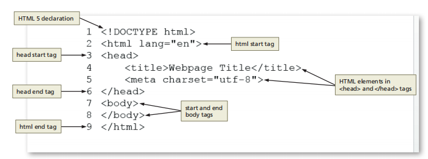

# TITO_Trainning_HTMLCSS

## Frontend training plan
## HTML CSS

  
## Table of contents

### [Chapter 1. Introduction to the Internet and Web Design]()

  

__23/05/2023__

### Chapter 1. Introduction to the Internet and Web Design

Objectives

• Define the Internet and associated key terms
• Recognize Internet protocols
• Discuss web browsers and identify their main features
• Describe the types and purposes of websites
• Plan a website for a target audience
• Define a wireframe and a site map
• Explain how websites use graphics,navigation tools, typography, and color
• Design for accessibility
• Design for multiplatform display
• Define Hypertext Markup Language (HTML) and HTML elements
• Recognize HTML versions and web programming languages
• Identify web authoring tools
• Download and use a web authoring tool
• Create and view a basic HTML webpage

Project — Create a Basic Webpage

Roadmap

1. __RUN__ a __text editor__ and __create__ a __blank document__.
2. __Enter html tags__ in the document.
3. __Add text__ to the webpage.
4. __Save__ the __webpage__ as an HTML document.
5. __View__ the __webpage__ in a browser.

__24/05/2023__

Planning a Website

Purpose of the Website

- Each purpose demands a different type of website and design. 

- Example : 

> 1.The purpose of a website is to serve as an online store, the website should allow easy access to product information, reviews, and e-commerce tools.

> 2.The purpose of the website is to build a company’s reputation, the website should feature articles about the company, its employees, and its products and integrate with social media sites such as Facebook.

Target Audience

- You should understand the people who will use the website

- Knowing the makeup of your target audience — including age, gender general demographic background, and level of computer literacy — helps you design a website appropriate for them.

Multiplatform Display

__How do I consistently reach the people in my target audience when they are using so many difference devices?__

>  The solution is to use responsive design, which allows you to create one website that provides an optimal viewing experience across a range of devices. The website itself responds and adapts to the size of screen on the visitor’s device. 

Wireframe

__What tools can I use to create a wireframe?__

>You can use one of several free tools to create a wireframe, including Pencil Project, Mockplus, and Wireframe CC. You can also use drawing tools in Microsoft Word or PowerPoint or a pen and paper.

Site Map

- Shows the structure of a website

Graphics

- Add visual appeal to a webpage and enhance the visitor’s perception of your products and services.

Navigation

- The navigation of your website should be clear and concise.
- The navigation area should be prominent and easy to use. 
- Incorporating a search box near the navigation area provides another avenue for customers to find the item they want.

Typography

- The use of effective typography, or fonts and font styles, enhances the visual appeal of a website. 
- Above all, the text must be legible or the website is useless. 
- Typography also should promote the purpose and goal of the website.

Color

- Select a limited number of coordinated colors that help promote your purpose and brand.
- The combination of colors, also called a color scheme, contributes to the appeal and legibility of the website.
- Font and background colors must provide high color contrast for readability, so use dark text on a light background or light text on a dark background. 

Accessibility

- The mission of the W3C is “to lead the World Wide Web to its full potential by developing protocols and guidelines that ensure the long-term growth of the Web.” Information about the membership process is available at www.w3.org /consortium/membership.

Accessibility Standards for Webpage Developers

- According to the W3C, the goal of the web is to be accessible to all people, including those with a disability that limits their ability to perform computer tasks. 
- Anyone who wants to use the web must have content that incorporates the principles as follows:

+ __Perceivable:__ Information and user interface components must be presentable to users in ways they can perceive. Users must be able to perceive the information being presented. (It cannot be invisible to any of their senses.)Operable: User interface components and navigation must be operable. Users must be able to operate the interface. (The interface cannot require interaction that a user cannot perform.)

+ __Understandable:__ Information and the operation of the user interface must be understandable. Users must be able to understand the information as well as the operation of the user interface. (The content or operation cannot be beyond their understanding.)

+ __Robust:__ Content must be robust enough that it can be interpreted reliably by a wide variety of user agents, including assistivetechnologies. Users must be able to access the content as technologies advance. (As technologies and user agents evolve, the content should remain accessible.)

Planning Checklist

Understanding the Basics of HTML

HTML Elements and Attributes

- What does the hr in 
 mean?

> Prior to HTML 5, the hr meant horizontal rule or reference. It is now called a thematic break and is used to distinguish between various topics on a single webpage.

Technologies Related to HTML

- XML — The W3C introduced XML (Extensible Markup Language) in 1998 to exchange and transport data. It does not replace HTML, but rather, can work with HTML by transporting web data obtained through an HTML webpage.
- XHTML — XHTML (Extensible Hypertext Markup Language) is a rewritten version of HTML using XML and was developed in 2000. Its syntax rules are more strict than HTML. It was created to work with XML-based user agents.

Understanding the Role of Other Web Programming Languages

JavaScript

- _JavaScript_ is a popular scripting language used to create interactivity within a web browser. Common uses for JavaScript include creating popup windows and alert messages, displaying the current date, and validating form data. JavaScript is a client-side scripting language, which means that the browser processes it on the client computer. JavaScript fles are typically named script with an .js fle extension. 
> JavaScript fles are referenced within an HTML fle through the use of a script element, as in .  Reference to this fle is typically placed above the closing body tag. 

jQuery

- _jQuery_ is a library of JavaScript programs designed for easy integration onto a webpage. jQuery makes it easy for web developers to add JavaScript to a webpage. The JS Foundation, formerly known as the jQuery Foundation, (https://js.foundation) is a community of web developers that work together to create JavaScript ecosystem projects. Their mission is to “drive broad adoption and ongoing development of key JavaScript solutions and related technologies.” 

PHP

- PHP (Hypertext Preprocessor) is an open-source scripting language often used for common tasks such as writing to or querying a database located on a central server. PHP is a  server-side scripting language, which means that the PHP script is processed at the server. The result of the PHP script is often an HTML webpage that is sent back to the client. Pages that contain PHP scripts must have fle names that end with the fle extension .php.

ASP

- ASP (Active Server Pages) is a server-side scripting technology from Microsoft used to accomplish many of the same server-side processing tasks as PHP. Pages that contain ASP scripts must have fle names that end with the fle extension .asp.

__25/05/2023__

Using Web Authoring Tools

- Online Code Editors :

+ _Plunker_
+ _CodePen_

Creating a Basic Webpage

- __Do I have to indent certain lines of HTML code?__
_Indenting lines of code is not required, but it helps improve the readability of the webpage. In Figure 1–31, Lines 4 and 5 are indented to clearly show the elements contained in the <head> and </head> tags. If the code included elements between the <body> and </body> tags, those lines could also be indented to make them easier to read. Using indents is a good web design practice._

